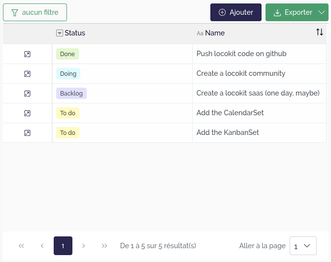
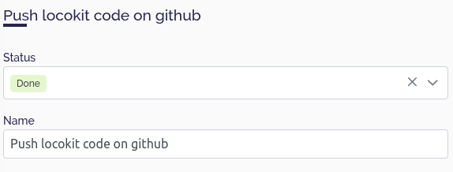
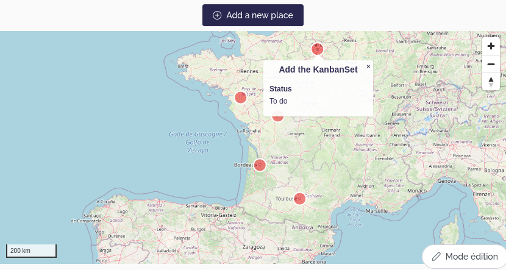
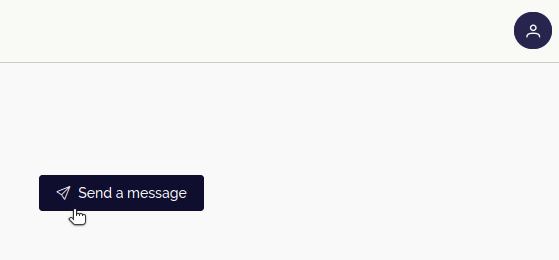
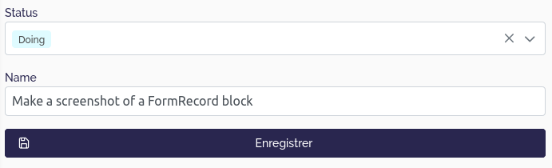

# Blocks

When you start to configure your application,
several blocks will be available to you.

Each block will have dedicated settings.
Some of them are related to data in your database,
others are just for presentation.

This section will describe all block types we have created until now.

## Presentation blocks

Presentation blocks are here to display any arbitrary information.

### Paragraph

Paragraph blocks display unformatted text.

### Markdown

Markdown blocks display markdown text, allowing you
to display text written in markdown.

You can check Markdown syntax in the [wikipedia page](https://en.wikipedia.org/wiki/Markdown#Examples).

### Media

Media blocks are intented to display images and videos. For now, you can use it to display a single external image by specifing its URL.

## Data blocks

Data blocks allow user to access data from your workspace.

According to workspace's permissions,
user will be able to **c**reate, **r**ead, **u**pdate or **d**elete
data.

Any data block need to be connected to a **view** 
of your tables.

### TableSet

Display a list of records, using the spreadsheet UI.

Some options can be configured to display a way :
- to add a new record from a modal form containing the editable and displayable fields of the view.
- to export the records. Only displayable and transmissible view fields are exported.
- to access to the record details. You must select one of the pages of the current chapter which will be used for this purpose. For example, the linked page could contain a DataRecord block connected to a view associated to the same table that the view of the current TableSet block.

|  |
| :--: |
| List records with a TableSet block |

### DataRecord

Display a single record in a "detail" view. More precisely, this block lists all the fields that have been configured as displayable for the view with the corresponding value of the record, either in read-only or edit mode depending on the field configuration.
|  |
| :--: |
| Display the details of a record with a DataRecord block |

### MapSet

Display a list of records on a map.

This block needs settings for specifying which geometry fields
need to be used.

Moreover, you can display a popup when the user clicks on or hovers over an item. This popup may display information related to the targeted element.

If you want to display several geographical fields on the same map, it is recommended to add a geographical source by geographical field by specifying at least the view that contain this field and the field itself.

Furthermore, you can also aggregate the records to display only one geographical element for a set of records. In this case, the aggregation field must be a *Link to another table* field and the displayed geographic fields must be *Lookup* or *Virtual lookup* fields linked to the aggregation field and must contain geographical data. Note that a `point_count` property is automatically added to the Mapbox source data which corresponds to the number of elements that have been aggregated on a single point. 

|  |
| :--: |
| Display geographical data in a map with a MapSet block |

#### Advanced configuration

The settings UI for the MapSet block display a subset
of all the settings the block accept.

By defining an advanced configuration, 
you can define more fine-grained settings,
concerning map style, or interactions between blocks.

There are several complementary ways to define the style of the geographical data displayed by this block. This style is specific to one geographical **source** and translated into the Mapbox style format. It contains the following properties:

- `default` (facultative): contains the default style that you want to apply.

  It must be an object respecting a format depending on the field type:

  - **Point geometry** and **Multi-point geometry** :
    ```typescript
    {
      // Customize the filled part of the circle
      fill?: {
        color?: string; // The color, respecting the Mapbox color format
        width?: number; // The radius, in pixels
      };
      // Customize the circle's border
      stroke?: {
        color?: string; // The color, respecting the Mapbox color format
        width?: number; // The width, in pixels
      };
      // Display an external icon
      icon?: string; // URL of the icon to display. Be careful, with this property, the stroke color will no be used and the unit used to compute the size of the point (fill width) will no be the pixel but the original icon size
      // The next two properties allow you to override the previous ones by using the Mapbox style properties directly
      layout?: object;
      paint?: object;
    }
    ```

  - **Linestring geometry** and **Multi-linestring geometry** :
    ```typescript
    {
      // Customize the line
      fill?: {
        color?: string; // The color, respecting the Mapbox color format
        width?: number; // The stroke thickness, in pixels
      };
      // The next two properties allow you to override the previous ones by using the Mapbox style properties directly
      layout?: object;
      paint?: object;
    }
    ```

  - **Polygon geometry** and **Multi-polygon geometry** :
    ```typescript
    {
      // Customize the filled part of the polygon
      fill?: {
        color?: string; // The color, respecting the Mapbox color format
      };
      // Customize the polygon's border
      stroke?: {
        color?: string; // The color, respecting the Mapbox color format
      };
      // The next two properties allow you to override the previous ones by using the Mapbox style properties directly
      layout?: object;
      paint?: object;
    }
    ```

- `dataDriven` (facultative): contains the styles that you want to use to customize the layers depending on the fields values. Must be an array containing objects which respect this format:
  ```typescript
  {
    // The condition to apply the style
    values: {
      field: string; // uuid of the field to check
      value: unknown; // value that the field must have to apply associated style
    }[];
    // The style to apply if the conditions are met 
    style: object; // Same as the default style but without the layout and paint properties
  }
  ```

- `fields` (mandatory if you use the previous property): a list containing the uuids of the fields that you want to use to customize the layers depending of the fields values.


Example of configuration :

```json
{
  "sources": [
    // Define a first source that will contain our geographical data (Point field)
    {
      // Id of the table view that contains the geographical data
      "id": "[TABLE_VIEW_ID]",
      // The geographical data is aggregated according to the value of this field
      "aggregationField": "[RBT_FIELD_ID]",
      // Choose to display the popup
      "popup": true,
      // Only display the popup on hover
      "popupSettings": {
        "onHover": true
      },
      // Custom the style layer
      "style": {
        // Define a default style
        "default": {
          "fill": {
            "width": 0.5
          },
          // Display icons instead of circles
          "icon": "/themes/capel/marker/diving-mask.png",
          // Use mapbox layer style properties
          "paint": {
            "icon-opacity": 1
          },
          "layout": {
            // Display the number of records that have been aggregated
            "text-field": [
              "get",
              "point_count"
            ],
            "text-anchor": "bottom-left",
            "text-offset": [
              1,
              0
            ]
          }
        },
        // Fields that will be used to custom the style depending on their values
        "fields": [
          "[LUC_PUBLIC_FIELD_ID]",
          "[LUC_TYPE_FIELD_ID]"
        ],
        // Styles to apply to customize the map layers depending on the fields values
        "dataDriven": [
          {
            // Choose another icon
            "style": {
              "icon": "/themes/capel/marker/shipwreck.png"
            },
            // Conditions to meet to apply the style (artificial and public point) 
            "values": [
              {
                "field": "[LUC_TYPE_FIELD_ID]",
                "value": "[ARTIFICIAL_OPTION_ID]"
              },
              {
                "field": "[LUC_PUBLIC_FIELD_ID]",
                "value": true
              }
            ]
          },
          {
            // Choose another icon
            "style": {
              "icon": "/themes/capel/marker/userspot.png"
            },
            // Conditions to meet to apply the style (private point)
            "values": [
              {
                "field": "[LUC_PUBLIC_FIELD_ID]",
                "value": false
              }
            ]
          }
        ]
      }
    }
  ]
}
```

If we want to display the points even if the displayed texts overlap,
we can add the following property to the layout object (default style):

```
  "text-allow-overlap": true
```

### MapField

Display a single record on a map.

This block works in the same way as the **MapSet** block except that only one source can be configured, and therefore displayed.


### ActionButton

Display a button which can be clicked to trigger a process or to go to another page.

It should be placed in a details page i.e. a page linked to a single record, allowing for example to deactivate or not the button depending on the value of a view field of this record.

If a process is triggered, a notification can be displayed on the screen depending on the success or the failure of the process.

|  |
| :--: |
| Trigger a process with an ActionButton block |


### MarkdownField

Display the value of a view field of one record, in a markdown component, allowing you to customize its style.

### FormRecord

Display a creation form allowing to create a record in the table associated with the chosen view.

It is very similar to the DataRecord block but for creation.

|  |
| :--: |
| Create a new record with a FormRecord block |


### ExternalApp

Display an iframe whose the url is specified in the settings, allowing to embed an HTML page.

The url consists of static and/or dynamic parts, specified in the block settings in the `parts` property that contains a list of the differents parts of the URL.

If the part is static, we configure it as this example:
```json
{
  "type": "String",
  "string": "https://locokit.io/iframe/" 
}
```

If the part is dynamic, we can provide a view and a field of this view whose the corresponding value of the record will be added to the url, as this example:
```json
{
  "type": "Source",
  "id": "[TABLE_VIEW_ID]",
  "fieldId": "[FIELD_ID]"
}
