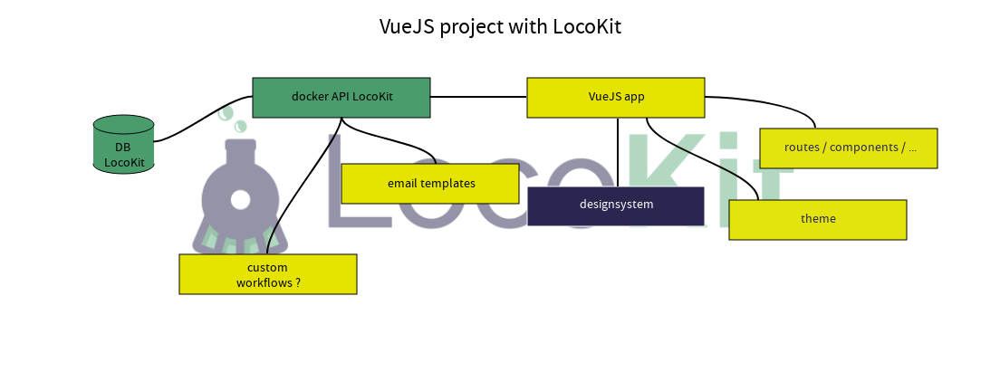

# Architecture

LocoKit is divided in two main parts : the API side and the App side.

The API is powered by [Feathers 5](https://dove.feathersjs.com/).

The App is powered by [Nuxt 3](https://v3.nuxtjs.org).

## Global architecture

Here is the global architecture,
explaining the "big" parts (app / api)
and all the packages used under.

The API part use a database.
It can be a SQLite or a PostGreSQL one.

Under the hood, the Feathers API use a Feathers service called `feathers-locokit`.

This service is able to use the LocoKit `engine`
to connect to a **data source**.
Additionaly, the service is able to create a meta model
of the **data source**, manage permissions,
expose API endpoints to create UIs for interacting with the data.

A **data source** can be a database, or something containing data.
Actually, the `engine` is able to connect to a PostGreSQL/PostGIS database,
or a SQLite one.
We could imagine that, in the future, the `engine` would be able
to connect to an API (eg AirTable, Open Data sources, API-based tools),
CSV/XLS files, or anything containing data.

Above the `engine`, so in the `feathers-locokit` service,
a security layer is available to manage users / groups,
and add datasource filters to restrict data accessibility. (in read or write mode)

On the frontend side, the Nuxt App
use the `nuxt-locokit` module.

This module expose components (from the `designsystem` package),
pages, routing, middleware that setup the Nuxt App.
To access the data from the LocoKit API,
a `sdk` package is available, and used by the module.

Concerning translations, `nuxt-locokit` and `designsystem` packages
use another package, `i18n`.
This last package hold localisation files, one per supported language.

## Nuxt project

Nuxt 3 is used for the LocoKit frontend.

The module `nuxt-locokit` could be used with a fresh Nuxt app too.

This is the recommended way to do, and maybe the most supported way.

To help developer that wish a customisation of their LocoKit instance,
we offer the ability to extend/overwrite the `nuxt-locokit` module.

By creating a new Nuxt app,
installing the `nuxt-locokit` module,
users will be able to decide which submodules will be installed.

Or which API URL to use to access the data.

::: warning
This section needs better documentation.
If you want to help us, or need this section,
please create an issue for this topic and ping us !
:::

## VueJS project

For developers that want to use VueJS directly,
without using Nuxt (that is the recommended way),
we offer our `designsystem` to be used in your VueJS app.

::: warning
You have to understand that if you go in that way,
you won't have the auth, frontoffice, backoffice and user management
submodules of the `nuxt-locokit` module.
:::

To use correctly this package,
you will have to add others package too :
* tailwind CSS
* Prime Vue 3
* vue-i18n for localisation
* @locokit/i18n package

Each of this package need to be initialized correctly,
before using components from the `designsystem`.

::: warning
This section needs better documentation
and has not been toughly tested.
If you want to help us, or need help,
please create an issue for this topic and ping us !
:::

## Monorepo

LocoKit was - at the beginning - a polyrepo.

One repo for the backend, one for the frontend, and one last for shared typings.

After several months, we decide to switch to a monorepo.
But, because we didn't start in a monorepo at first,
we encounter some difficulties between TypeScript versions, eslint rules...

In this new version, LocoKit has been reboot, directly in a monorepo.

TypeScript version, linting (eslint, prettier), and other shared
dependencies are now the same.

This approach allow us also to maintain our work
in the `packages` directory, and shared them between our `api` and `app`.

https://www.robinwieruch.de/javascript-monorepos/
