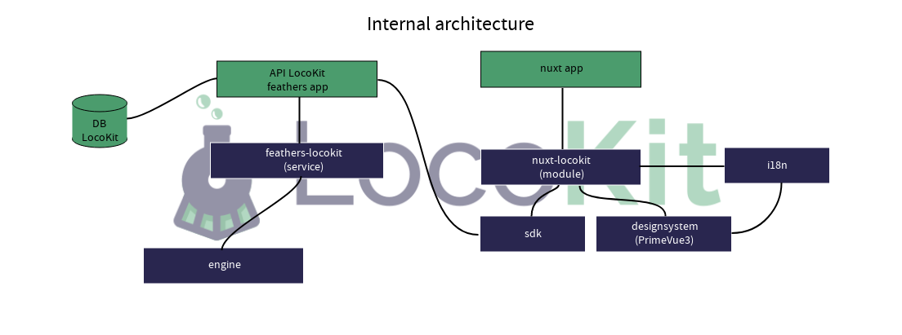

# Architecture

LocoKit is divided in two main parts : the API side and the App side.

The API is powered by [Feathers 5](https://dove.feathersjs.com/).

The App is powered by [Nuxt 3](https://v3.nuxtjs.org).

Here is the global architecture,
explaining the "big" parts (app / api)
and all the packages used under.

