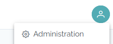
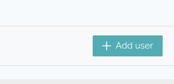
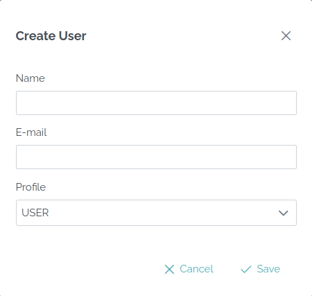

# User management

You can create a user by going on the Administration panel.

This panel is only available for users with the `SUPERADMIN` profile.

Then you access the management page, with users and groups.

To create a user, click on the "Add user" button :

Then fill the form :

Once this is done, the user will receive an email in its mailbox.

He has to open the link inside, he will be able to enter its password
respecting some security rules :
* 8 characters minimum
* 1 lowercase
* 1 uppercase
* 1 special char from these **!\"#$%&'()*+,-./:;<=>?@[\\]^_`{|}~**
* 1 digit

After this, he could access the LocoKit platform.

**Beware**, this will not give him access to any workspace.

If you want to give access to some workspace, 
you need to add it to the corresponding groups.