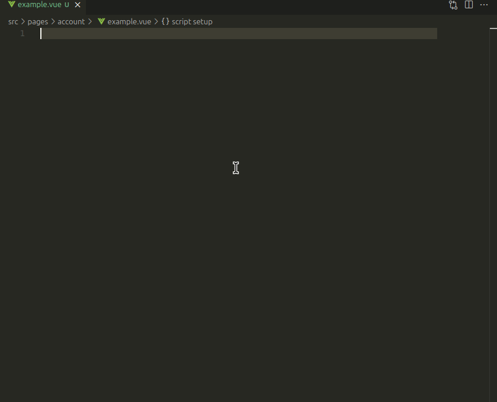

# LocoKit - Vue components library

This repository holds VueJS components.

Those components are used in the LocoKit back-office application,
and can also be used for front-office applications.

> [!IMPORTANT]
> This package is not yet stabilized.
> Some evolutions could break backward compatibility through versions until we reach the 1.x .


## Getting started

### Dependencies

The `@locokit/vue-components` needs some packages to work.

On a VueJS project, please add these dependencies :

```sh
pnpm add primevue @primevue/themes \ # primevue dependencies
  tailwindcss postcss autoprefixer tailwindcss-primeui \ # tailwind dependencies
  @locokit/locales vue-i18n \ # translation dependencies
  @locokit/vue-components @locokit/definitions \ # other @locokit dependencies
  primeicons bootstrap-icons # icons (bootstrap + prime)
```

### Configure files

Some files need to be created or updated :
* `src/main.{js,ts}`
* `src/styles.css` (or your CSS root file)
* `postcss.config.js`
* `tailwind.config.js`

**`src/main.{js,ts}`**

In your `src/main.{js,ts}` file, configure PrimeVue and vue-i18n as shown below.

```js
/* src/main.js */
import { createApp } from 'vue'

/**
 * Translation
 */
import { createI18n } from 'vue-i18n'
import en from '@locokit/locales/en.json'
import fr from '@locokit/locales/fr.json'

/**
 * PrimeVue
 */
import PrimeVue from 'primevue/config'
import Aura from '@primevue/themes/aura'

import './styles.css'
import App from './App.vue'

const i18n = createI18n({
  locale: 'en',
  fallbackLocale: 'en',
  messages: {
    en, fr
  }
})

const app = createApp(App)
app.use(i18n)
app.use(PrimeVue, {
  theme: {
    preset: Aura,
    options: {
      cssLayer: {
        name: 'primevue',
        order: 'tailwind-base, primevue, tailwind-utilities',
      },
    }
  }
})

app.mount('#app')
```

* **`src/styles.css`** (or your root CSS file)

```css
/* src/styles.css */
@import url('bootstrap-icons/font/bootstrap-icons.css');
@import url('primeicons/primeicons.css');

@layer tailwind-base, primevue, tailwind-utilities;

@layer tailwind-base {
  @tailwind base;
}

@layer tailwind-utilities {
  @tailwind components;
  @tailwind utilities;
}
```

* **`postcss.config.js`**

If you already have installed Tailwind CSS,
this file is probably already in your code base.

```js
/* postcss.config.js */
export default {
  plugins: {
    tailwindcss: {},
    autoprefixer: {},
  },
}
```

* **`tailwind.config.js`**

> [!WARNING]
> You need to add the `@locokit/vue-components` package to the content
> analyzed by Tailwind CSS to collect classes used in our components.
>
> If you don't do this, `vue-components` won't be displayed correctly.


```js
/* tailwind.config.js */

/** @type {import('tailwindcss').Config} */
export default {
  content: [
    ...
    // adding the vue-components is mandatory to detect all used classes
    './node_modules/@locokit/vue-components/dist/**/*.js',
  ],
  ...
  plugins: [require('tailwindcss-primeui')],
  ...
}
```

## Use it !

To import components, you can :

```js
// import them separately
import { SingleTag } from '@locokit/vue-components'
// then use it with <single-tag /> or <SingleTag />

// import components & layouts
import { components, layouts } from '@locokit/vue-components'
// then use <components.SingleTag />
```

Autocomplete for properties and events is provided in IDE like VS Code :



## Dependencies

**[@locokit/definitions](https://www.npmjs.com/package/@locokit/definitions)**

This package contains typings and some helpers.

**[i18n](https://vue-i18n.intlify.dev/) + [@locokit/locales](https://www.npmjs.com/package/@locokit/locales)**

This library provides `vue-i18n` and the `t` function for translation purpose,
used in `vue-components`.

**[primevue](https://primevue.org/) @primevue/themes**

`vue-components` is based on `primevue` components.

See https://primevue.org/vite/ for further information.

**[tailwindcss](https://tailwindcss.com/) + postcss + autoprefixer + [tailwindcss-primeui](https://github.com/primefaces/tailwindcss-primeui/)**

`vue-components` uses also Tailwind CSS, combined with PrimeVue components.

To combine Tailwind CSS and PrimeVue, we use `tailwindcss-primeui` plugin.

Please see https://tailwindcss.com/docs/guides/vite#vue for further information.

**[primeicons](https://primevue.org/icons/) [bootstrap-icons](https://icons.getbootstrap.com/)**

Icons from these two packages are used, and are available for your project too.

## For developers

> [!TIP]
> If you encounter any issue,
> if a feature is missing
> or if you have ideas to develop new components,
> please submit issues first to discuss with us.

A storybook is included in this project.

Run it with `pnpm dev`.
